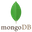
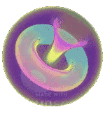
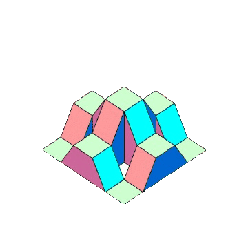

<!-- Introducing myself -->

 

## 🐧 Hi there 👋, I am Atik

    

 
&nbsp;
&nbsp;
&nbsp;
&nbsp;
<!---->

 

### Physics, Computer and Technology I am all in

- 🔭 I’m currently working on my Portfolio Website :grin:
- 🌱 I’m currently learning MERN Stack Development.
- 👯 I’m looking to collaborate with other Developers :wink:
- 🥅 2025 Goals: Build something useful
- 💬 Ask me about anything, I am happy to help :smile:
- 📬 How to reach me: [Let's get in touch!][linkedin]
- 🧗 I try to: Go beyond and push the bounds
- ⚡ Fun fact: I am 90's kid :raised_hands:

 

### Languages and Tools: 

<!--  -->

<!--  -->
<!--  -->
<!--  -->

<!--  -->

 
 
 

#
<h2> Github Trophies </h2>

#

<h3>GitHub activity Stats</h3>

&nbsp;

