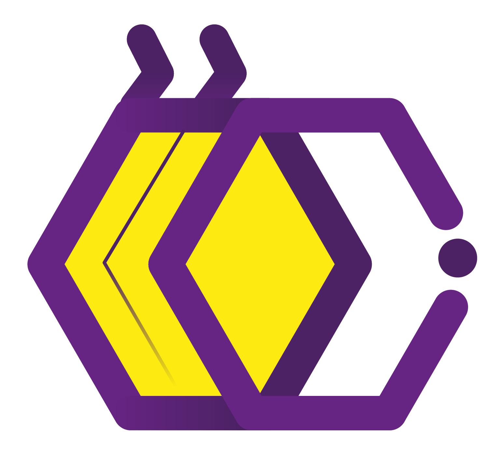

<!-- Introducing myself -->

## 🐧 Hi there 👋, I am Atik

  
  

  <pre style="font-family: 'MyFont';
  position: absolute;
  top: 0;
  left: 0;
  width: 100%;
  height: 100%;
  z-index: 2;
  display: flex;
  align-items: center;
  justify-content: center;
  color: white;
  text-align: center;
  font-size: 1.4em;
  padding: 1rem;
  white-space: pre-wrap;
  box-sizing: border-box;">
I opened the door and stepped outside,
To catch the moonlight’s grace;
My hands reached out, aglow with hope—
But nothing stayed in place.
  </pre>

# <h2>Useful links</h2>
- 

    beecrowd profile <a href="https://www.beecrowd.com.br/judge/en/profile/909465"
        style="font-weight:bold; color: #dd7845;">neo-unplugged</a>

- 
 codewars profile <a
        href="https://www.codewars.com/users/UniAtik" style="font-weight:bold; color: #de4573;">UniAtik</a>

#
<h2> Quote of the day </h2>

#
<h2> Github Trophies </h2>

#

<h3>GitHub activity Stats</h3>

&nbsp;

#
<h3>Skills</h3>

    
    
    
    
    
    
    
    

