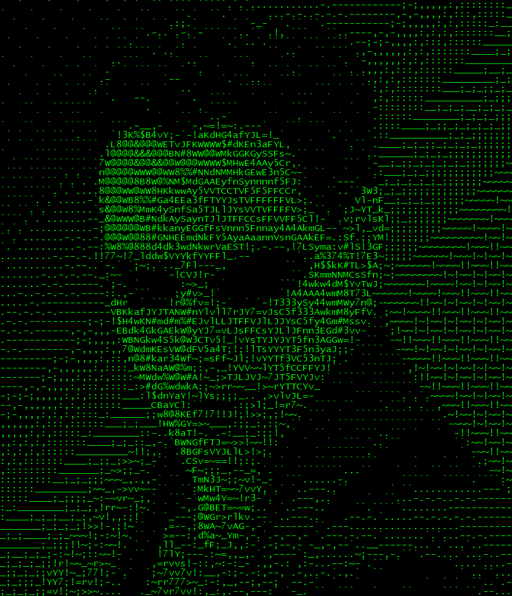

<!-- Introducing myself -->

## 🐧 Hi there 👋, I am Atik

**`Programmer | Scientist | Innovator `** 

- 🔭 I’m currently working on **Beecrowd Problems**
- 🌱 I’m currently learning **`Godot Game Engine`** , **`Programming in Python`** and **`Theoretical Physics`**
- 🤔 I’m looking for help with learning **`Godot Game Engine`**
- 💬 Ask me about my **`Interests`**, **`Progress`**
- 📫 How to reach me: <a href="mailto:one.atik99@gmail.com">**`one.atik99@gmail.com`**</a>
- ⚡ Fun fact: **`being 90s kid`**

# <h2>Useful links</h2>
- 
 beecrowd profile <a href="https://www.beecrowd.com.br/judge/en/profile/909465" style="font-weight:bold; color: #dd7845;">neo-unplugged</a>

- 
 codewars profile <a href="https://www.codewars.com/users/UniAtik" style="font-weight:bold; color: #de4573;">UniAtik</a>

#
<h2> Quote of the day </h2>

#
<h2> Github Trophies </h2>

#
<h3>GitHub activity Stats</h3>

&nbsp;

---
