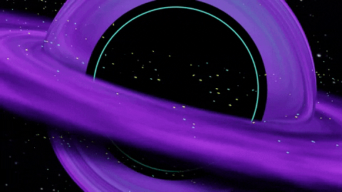

<!-- Introducing myself -->

## 🐧 Who am I?

A curious physics student building stuff.

I’m interested in:

- Physics simulations
- Computational Physics
- Physical law exploration
- Building generalizable solutions from first principles

## 🧠 Core Languages

I speak of Reality with...

[ C/C++, Python, Java, Kotlin, Golang ]

and physics.

> Physics × Computation → Structural insight.

