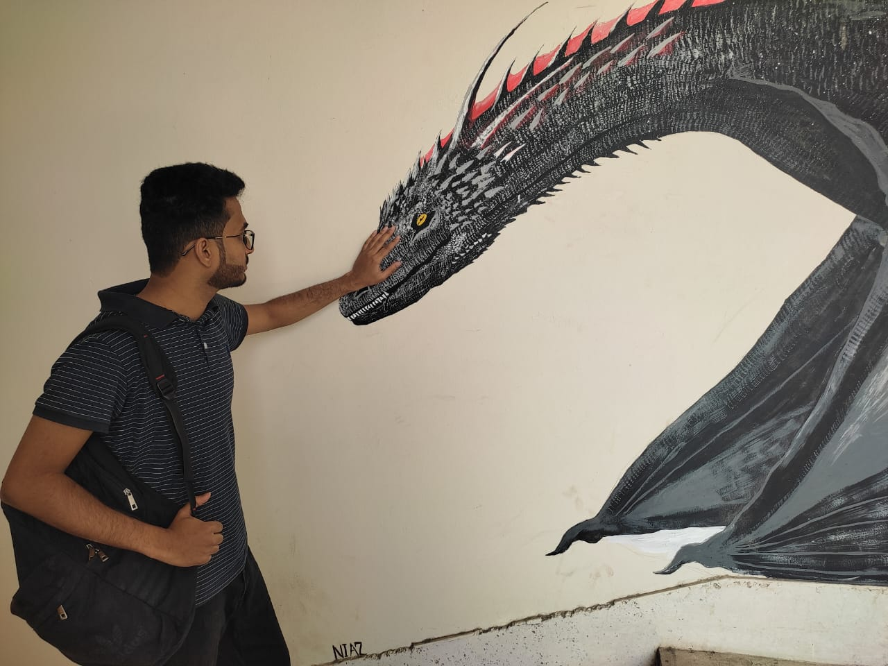

<!-- Introducing myself -->

## 🐧 Hi there 👋, I am Atik

**`Programmer | Physicist | Innovator `** 

# <h2>Useful links</h2>
- 

    beecrowd profile <a href="https://www.beecrowd.com.br/judge/en/profile/909465"
        style="font-weight:bold; color: #dd7845;">neo-unplugged</a>

- 
 codewars profile <a
        href="https://www.codewars.com/users/UniAtik" style="font-weight:bold; color: #de4573;">UniAtik</a>

#
<h2> Quote of the day </h2>

#
<h2> Github Trophies </h2>

#

<h3>GitHub activity Stats</h3>

&nbsp;

#
<h3>Skills</h3>

    
    
    
    
    
    
    
    

